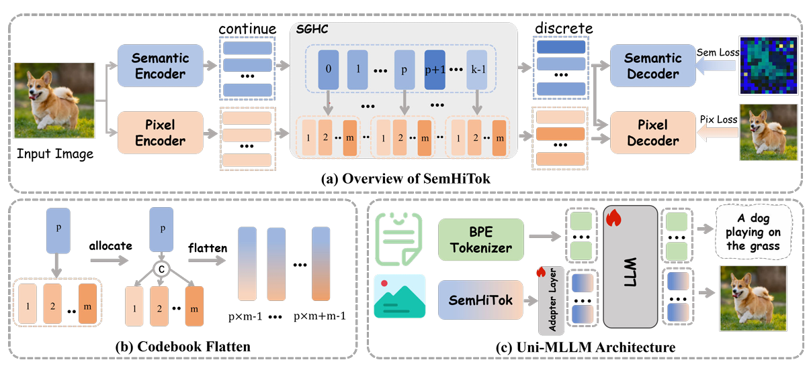
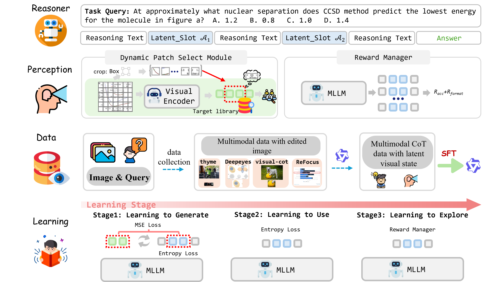
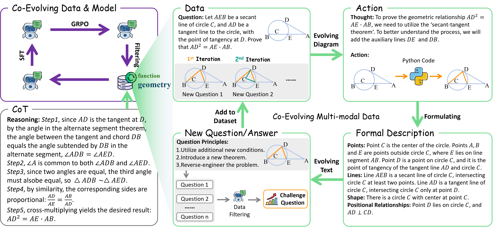
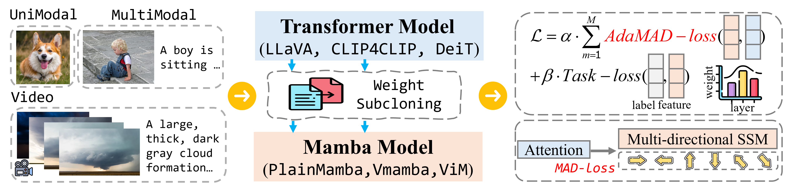
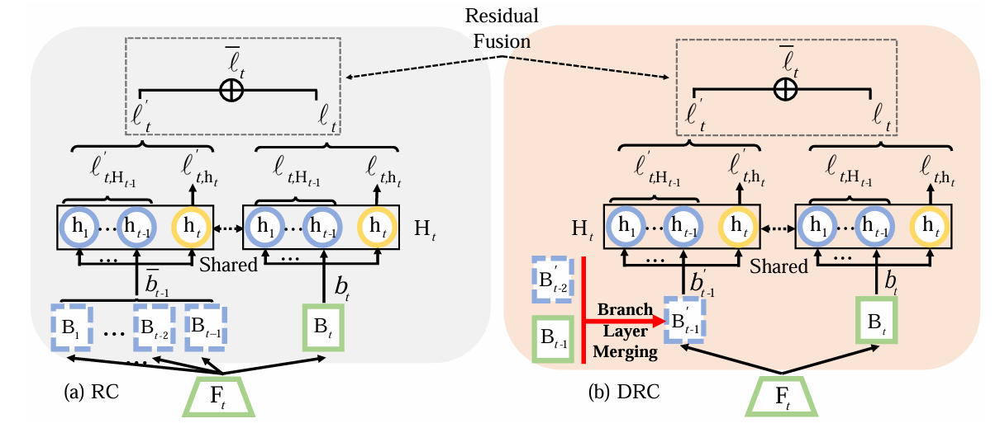

<link rel="stylesheet" href="https://cdnjs.cloudflare.com/ajax/libs/font-awesome/5.15.3/css/all.min.css">

    

        

            
        

        
Xiuwei Chen

        

            Ph.D. Student 
            HCP Lab, SYSU 

        <ul class="contact-info">
            <li>
                <a href="mailto:chenxw83@mail2.sysu.edu.cn" target="_blank" title="Email" aria-label="Email">
                    <i class="fas fa-envelope"></i>
                </a>
                <a href="https://scholar.google.com/citations?user=313kmTAAAAAJ&hl=zh-CN" target="_blank" title="Google Scholar" aria-label="Google Scholar">
                    <i class="fas fa-graduation-cap"></i>
                </a>
                <a href="https://github.com/chen-xw" target="_blank" title="GitHub" aria-label="GitHub">
                    <i class="fab fa-github"></i>
                </a>
                <a href="https://www.linkedin.com/in/your-profile" target="_blank" title="LinkedIn" aria-label="LinkedIn">
                    <i class="fab fa-linkedin"></i>
                </a>
            </li>
        </ul>
    

    

        
        
About Me
 

             I am currently a Ph.D candidate in HCP Group at <a href="https://sai.sysu.edu.cn/">Sun Yat-sen University (SYSU)</a>, supervised by <a href="https://scholar.google.com/citations?user=voxznZAAAAAJ&hl=zh-CN">Prof. Xiaodan Liang</a>. I received my Master's degree at the <a href="https://www.sysu.edu.cn/">Sun Yat-sen University (SYSU)</a>, supervised by <a href="https://xb-chang.github.io/">Prof. Xiaobin Chang</a>. Prior to SYSU, I obtained a B.Eng from <a href="https://www.tyut.edu.cn/">TYUT</a> and majored in Computer Science and Technology (CS) in 2021.
        

        

            My research interests focus on <strong>Multimodal Reasoning</strong>, including the <strong>Understanding</strong> and <strong>Self-Improvement</strong>. Priored that, my focus on Person Re-identification and Incremental Learning.
        

        
🔥 News
 <ul class="custom-list news-list">
            <li><strong>[2026.02]</strong> 🎉 One paper (<a href="https://arxiv.org/abs/2503.06764">SemHiTok</a>) is accepted by ICLR 2026.</li>
            <li><strong>[2025.12]</strong> 🔥 We release <a href="https://arxiv.org/abs/2502.15130">EVA</a>, a framework that internalizes explicit tool calling into the model's intrinsic capabilities.</li>
            <li><strong>[2025.07]</strong> 🔥 We release <a href="https://c2-evo.github.io">C2-Evo</a>, a method for co-evolving models and data, an agent for drawing auxiliary line.</li>
            <li><strong>[2025.02]</strong> 🔥 We release <a href="https://arxiv.org/abs/2502.15130">TransMamba</a>, a simple method to quickly adapt Transformer models to the Mamba framework.</li>
            <li><strong>[2023.10]</strong> 🎉 One paper is accepted by PRCV 2023.</li>
            <li><strong>[2023.07]</strong> 🎉 One paper (<a href="https://arxiv.org/abs/2308.13305">DRC</a>) is accepted by ICCV 2023.</li>
            <li><strong>[2021.01]</strong> Welcome to my new homepage!</li>
        </ul>

        
📝 Publications and Preprints

        <ul class="pub-list">

            <li>
                

                    

                        <!-- 在这里添加标签，文字可以改成 arXiv 2025 等 -->
                        ICLR 2026 
                        
                    

                    

                        

                            ICLR 2026 <a href="https://arxiv.org/abs/2503.06764">SemHiTok: A Unified Image Tokenizer via Semantic-Guided Hierarchical Codebook for Multimodal Understanding and Generation</a> 
                        

                        

                            Zisheng Chen, Chunwei Wang, Runhui Huang, Hongbin Xu, Xiuwei Chen, Jun Zhou, Jianhua Han, Hang Xu, Xiaodan Liang
                        

                        
ICLR 2026
 
                        
 
                            <a href="https://arxiv.org/abs/2503.06764" class="pub-btn">PDF</a>
                        
  
                    
    
                
   
            </li>

            <!-- 论文 1 示例 -->
            <li>
                

                    

                        <!-- 在这里添加标签，文字可以改成 arXiv 2025 等 -->
                        arXiv 2025 
                        
                    

                    

                        

                            Arxiv <a href="https://arxiv.org/abs/2502.15130">Latent Visual States for Efficient Multimodal Reasoning</a> 
                        

                        

                            Xiuwei Chen, Wentao Hu, Xiao Dong, Sihao Lin, Zisheng Chen, Meng Cao, Yina Zhuang, Jianhua Han, Hang Xu, Xiaodan Liang
                        

                        
arXiv 2025
 
                        
 
                            <a href="https://arxiv.org/abs/2502.15130" class="pub-btn">PDF</a>
                            <a href="https://github.com/chen-xw/TransMamba-main" class="pub-btn">Code</a>
                            <a href="https://github.com/chen-xw/TransMamba-main" class="pub-btn">Project Page</a>
                        
  
                    
    
                
   
            </li>
            
            <!-- 论文 2 示例 (记得改标签文字) -->
            <li>
                

                    

                        arXiv 2025
                        
                    

                    

                        <!-- ... 内容保持不变 ... -->
                         

                            Arxiv <a href="https://c2-evo.github.io/">C2-Evo: Co-Evolving Multimodal Data and Model for Self-Improving Reasoning</a> 
                        

                        

                            Xiuwei Chen, Wentao Hu, Hanhui Li, Jun Zhou, Zisheng Chen, Meng Cao, Yihan Zeng, Kui Zhang, Yu-Jie Yuan, Jianhua Han, Hang Xu, Xiaodan Liang
                        

                        
arXiv 2025
 
                        
 
                            <a href="https://arxiv.org/abs/2507.16518" class="pub-btn">PDF</a>
                            <a href="https://github.com/chen-xw/C2-Evo" class="pub-btn">Code</a>
                            <a href="https://c2-evo.github.io/" class="pub-btn">Project Page</a>
                        
  
                    
    
                
   
            </li>
            
            <!-- 论文 3 示例 -->
            <li>
                

                    

                        arXiv 2025
                        
                    

                    

                         <!-- ... 内容保持不变 ... -->
                         

                            Arxiv <a href="https://arxiv.org/abs/2502.15130">TransMamba: Fast Universal Architecture Adaption from Transformers to Mamba</a> 
                        

                        

                            Xiuwei Chen, Wentao Hu, Xiao Dong, Sihao Lin, Zisheng Chen, Meng Cao, Yina Zhuang, Jianhua Han, Hang Xu, Xiaodan Liang
                        

                        
arXiv 2025
 
                        
 
                            <a href="https://arxiv.org/abs/2502.15130" class="pub-btn">PDF</a>
                            <a href="https://github.com/chen-xw/TransMamba-main" class="pub-btn">Code</a>
                            <a href="https://github.com/chen-xw/TransMamba-main" class="pub-btn">Project Page</a>
                        
  
                    
    
                
   
            </li>
            
            <!-- 论文 4 示例 -->
            <li>
                

                    

                        ICCV 2023
                        
                    

                    

                        <!-- ... 内容保持不变 ... -->
                        

                            ICCV 2023 <a href="https://arxiv.org/abs/2308.13305">Dynamic Residual Classifier for Class Incremental Learning</a> 
                        

                        

                            Xiuwei Chen, Xiaobin Chang 
                        

                        
ICCV 2023
 
                        
 
                            <a href="https://arxiv.org/abs/2308.13305" class="pub-btn">PDF</a>
                            <a href="https://github.com/chen-xw/DRC-CIL" class="pub-btn">Code</a>
                            <a href="https://github.com/chen-xw/DRC-CIL" class="pub-btn">Project Page</a>
                        
  
                    
    
                
   
            </li>
            
        </ul>

        
🎓 Educations
 <ul class="custom-list">
            <li>2024.09 - now,  PhD Student, Sun Yat-sen University (SYSU) </li>
            <li>2021.09 - 2024.06,  Master of CS, Sun Yat-sen University (SYSU) </li>
            <li>2017.09 - 2021.06,  Bachelor of CS, The Taiyuan University of Technology (TYUT) </li>
        </ul>

        
💼  Experiences
 <ul class="custom-list">
            <li>2025.08 - now,  Research Intern, YinWang 2030 Lab, Supervisor: Hang Xu, Jianhua Han</li>
            <li>2024.07 - 2025.07,  Research Intern, Huawei Noah's Ark Lab, Supervisor: Hang Xu, Jianhua Han, Yihan Zeng </li>
            <li>2023.06 - 2023.08,  Algorithm Intern, Hikvision Research Institute, Supervisor: Jun Che </li>
        </ul>

        

            &copy; 2026 Xiuwei Chen. Last update: 2026.02.
        

    

